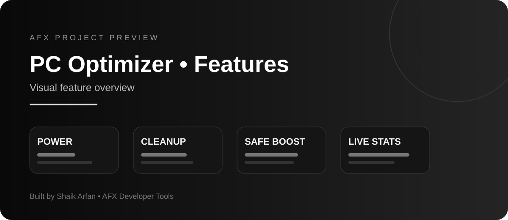

<p align="center">
  
</p>

<p align="center">
  
</p>

# AFX PC Optimizer

A lightweight Windows PC/laptop optimizer built with Python and Tkinter.


## What it does

AFX PC Optimizer focuses on **safe, understandable Windows maintenance** rather than risky "magic boost" tweaks.

### Features

- Live CPU, RAM, disk and uptime dashboard
- One-click **Safe Boost** (temp cleanup + DNS flush)
- Safe temporary-file scanner
- Deletes only temp files older than 24 hours
- Skips locked/in-use files
- Recycle Bin cleanup with confirmation
- DNS cache flush
- Running-process viewer
- Manual process termination with confirmation
- Startup-app viewer
- Shortcut to Windows Startup Apps settings
- Balanced / High Performance power-plan controls
- Windows restore-point shortcut
- Windows Storage settings shortcut
- Dark red/black AFX UI

## Safety design

This project intentionally **does not**:

- edit the Windows Registry for "gaming tweaks"
- disable Windows security
- disable Windows Update
- delete browser profiles or personal files
- automatically kill background processes
- remove drivers
- overclock hardware
- modify BIOS/UEFI settings

The cleaner only targets standard temporary folders and only files that are at least 24 hours old. Windows may still deny deletion of files that are currently in use; those are skipped.

> Always keep backups of important files. A system optimizer cannot guarantee FPS gains or faster hardware.

## Requirements

- Windows 10 or Windows 11
- Python 3.10 or newer
- `psutil`

## Quick start

### 1. Clone

```bash
git clone https://github.com/arfandev-devloper/AFX-PC-Optimizer.git
cd AFX-PC-Optimizer
```

### 2. Create a virtual environment

```bash
python -m venv .venv
.venv\Scripts\activate
```

### 3. Install dependencies

```bash
pip install -r requirements.txt
```

### 4. Run

```bash
python optimizer.py
```

Or double-click:

```text
run.bat
```

## Build a Windows EXE

Run:

```text
build_exe.bat
```

The executable will be generated in:

```text
dist\AFX-PC-Optimizer.exe
```

## Administrator rights

Most dashboard features work without administrator rights.

Some Windows actions may require an elevated terminal, especially:

- creating restore points
- accessing protected temporary files
- some power-plan operations

Run the application as Administrator only when you understand why elevated access is needed.

## Project structure

```text
AFX-PC-Optimizer/
├── optimizer.py
├── optimizer_core.py
├── tests/
├── .github/workflows/python-check.yml
├── requirements.txt
├── run.bat
├── build_exe.bat
├── .gitignore
├── LICENSE
└── README.md
```

## Recommended GitHub repository description

> Safe Windows PC optimizer with a modern AFX dashboard, temp cleanup, process insights, startup tools, DNS flush, power plans, and restore-point support.

## Roadmap

- Temperature monitoring when supported by hardware
- Optional game-mode profile
- Disk health / SMART viewer
- Exportable optimization report
- Signed Windows release builds
- Automatic update checker

## License

MIT License. See `LICENSE`.